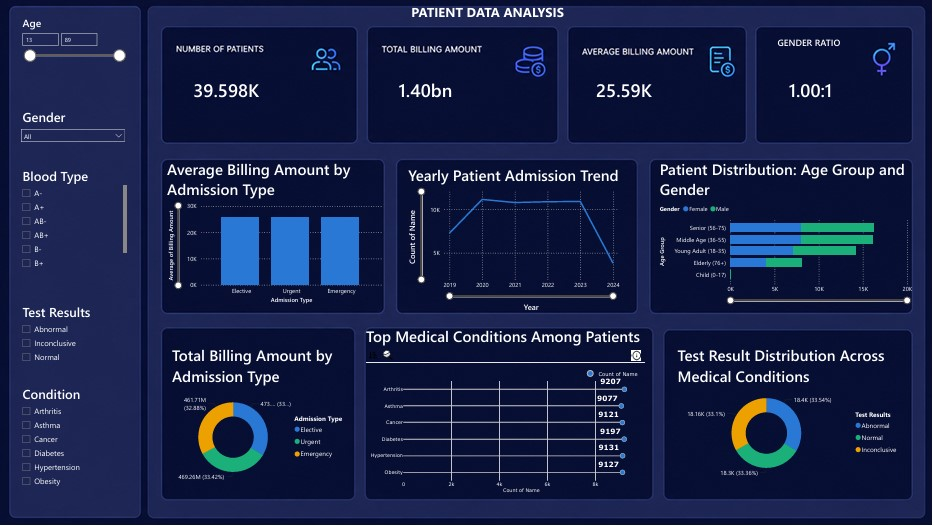
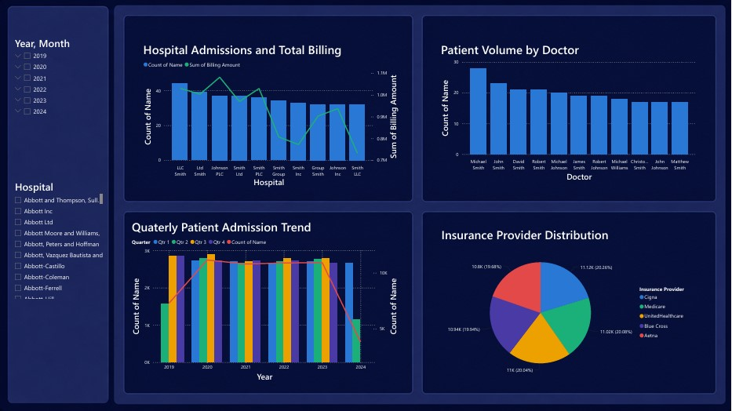

# 🏥 Healthcare Analytics Dashboard

An interactive healthcare analytics dashboard developed as part of the **BeTechified Advanced Data Analytics Course**.

## 📌 Project Overview

This project involved analyzing a healthcare dataset containing **1,000+ patient records** to explore patterns across patient demographics, medical conditions, hospital visits, and other healthcare-related factors.

As the **Power BI technical lead** for my group, I was responsible for designing and developing the dashboard, transforming the analyzed data into an interactive and accessible visual report.

## 📊 Dashboard

The dashboard was designed to provide a clear overview of the dataset and help users identify important trends and patterns through interactive visualizations.

### Dashboard Preview

## 🛠️ Tools Used

- **Power BI** — Dashboard development and data visualization
- **Data Analytics** — Data exploration and insight generation

## 🎯 Key Skills Demonstrated

- Data visualization
- Dashboard design
- Data analysis
- Interactive reporting
- Translating analytical findings into visual insights
- Collaborative project development

## 👩🏽‍💻 My Role

**Power BI Technical Lead**

I was responsible for:

- Designing the dashboard layout and user experience
- Developing the visualizations in Power BI
- Transforming analytical findings into meaningful visual representations
- Ensuring the dashboard communicated key patterns and insights effectively

## 🎓 Project Context

**BeTechified — Advanced Data Analytics Course**

This project was completed as part of a collaborative group project during the Advanced Data Analytics course.

---

*Built with Power BI as part of my data analytics learning journey.*
