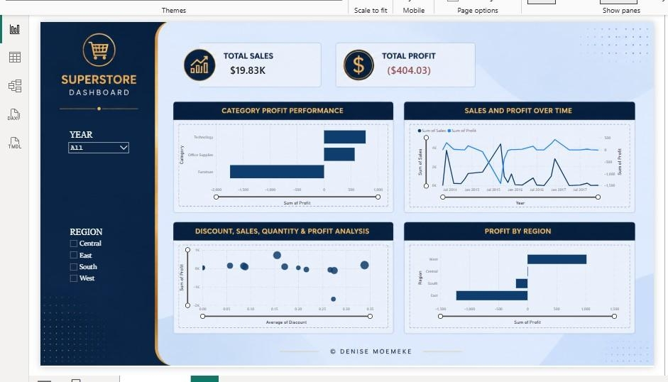
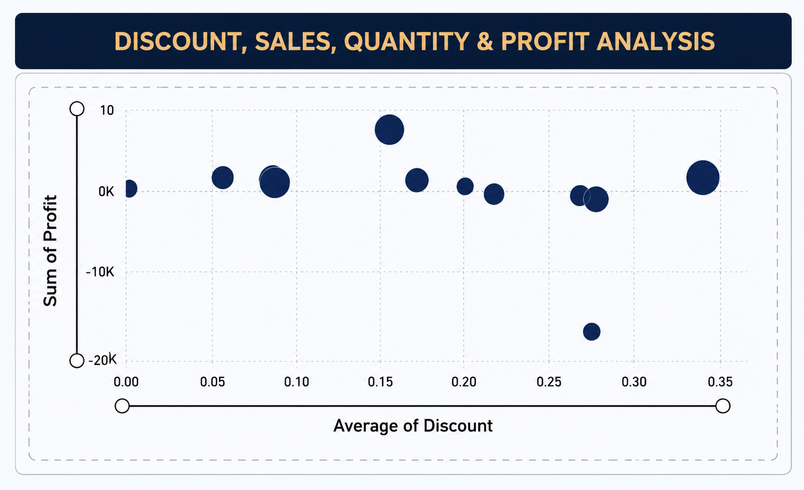
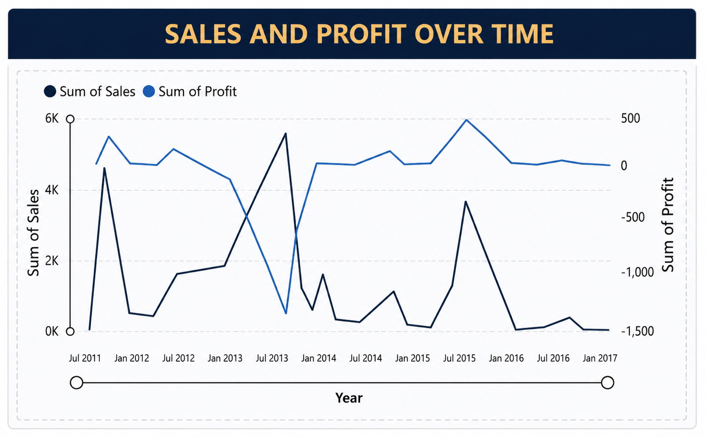
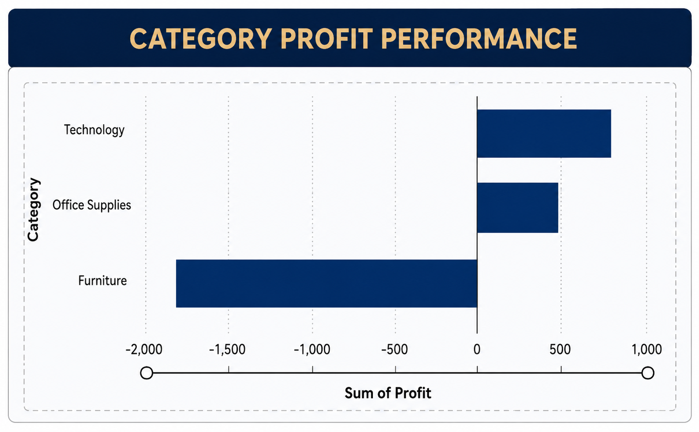
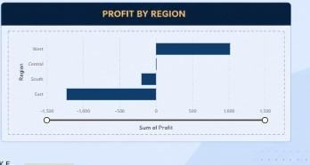

# 🛒 Superstore Sales Dashboard

An interactive sales analytics dashboard built using the **Superstore
dataset** to explore sales performance, profitability, product trends,
customer segments, and regional performance.

## 📊 Dashboard

The dashboard provides an interactive view of business performance,
allowing users to explore trends across products, customers, regions,
and time.

### Dashboard Preview

## 🔎 Key Areas Explored

- Sales and profit performance
- Product and category performance
- Regional sales trends
- Customer segment analysis
- Time-based sales patterns
- Profitability across products and regions

## 🛠️ Tools Used

- **Tableau** — Dashboard development and visualization
- **Data Analysis** — Exploratory analysis and insight generation

## 🎯 Skills Demonstrated

- Interactive dashboard design
- Data visualization
- Business analytics
- Data storytelling
- KPI development
- Trend and performance analysis

## 🔍 Dashboard Details

<table>
  <tr>
    <td></td>
    <td></td>
    <td></td>
    <td></td>
  </tr>
</table>
---

*Built as a data visualization project to explore business performance
through interactive analytics.*
